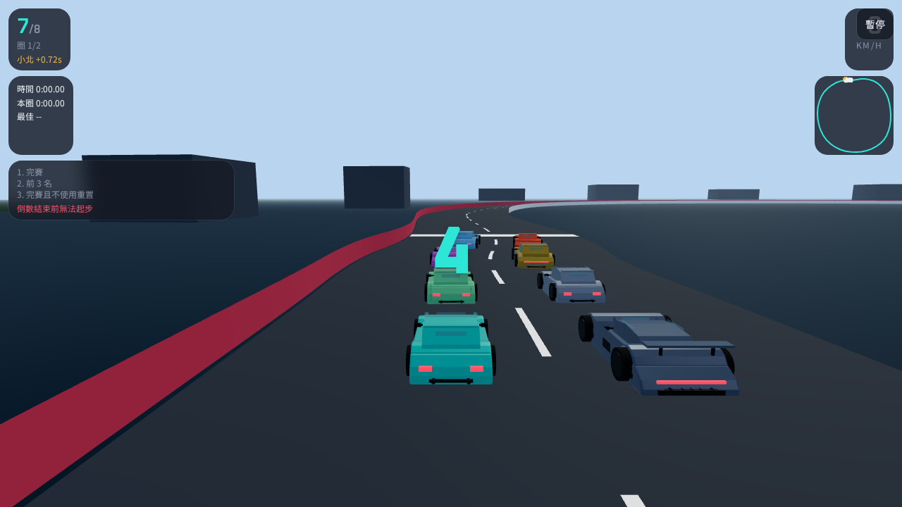
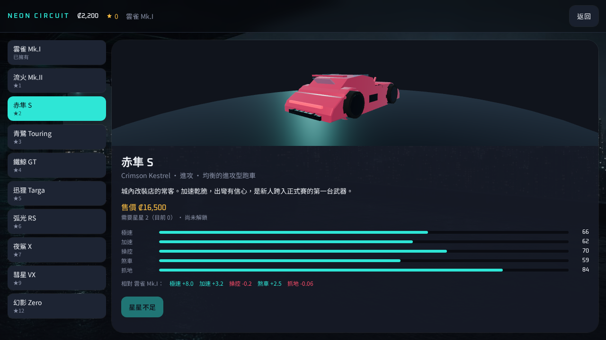
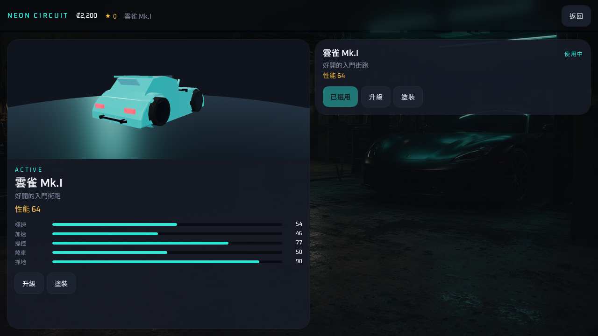
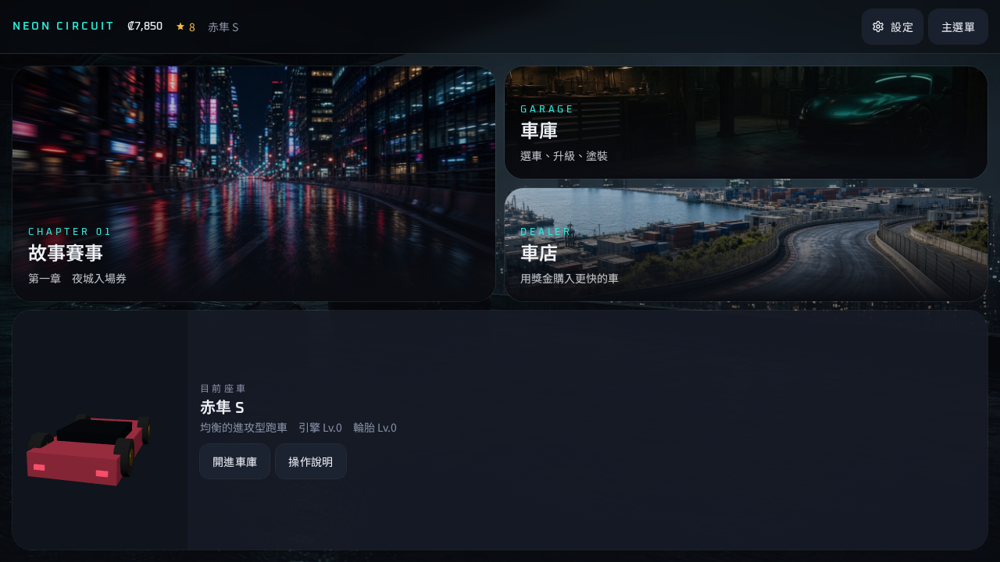

<p align="center">
  
</p>

<h1 align="center">霓虹環道 · Neon Circuit</h1>

<p align="center">
  原創街機風格 3D 生涯賽車<br>
  Original arcade 3D career racer in the browser
</p>
<p align="center">
  🎮 <a href="https://light-daisy-jade-bloom.grok.me"><strong>立即遊玩 · Play Now</strong></a>
</p>

<p align="center">
  
  
  
  
  
  
</p>

從入門車「雲雀 Mk.I」起步，與 7 台 AI 同場競技，賺取獎金與星星、升級或購買新車，挑戰銀線車隊。全程中文介面，無需帳號、後端或 API Key。進度存在瀏覽器本機。

Start in the Skylark hatch, race a field of 8, cash prizes, unlock stars, buy and tune original cars, and take on the Silver Line. Fully playable in a desktop browser.

---

## 畫面

<p align="center">
  
  
</p>
<p align="center">
  
  
</p>

---

## 目錄

- [啟動](#啟動)
- [操作](#操作)
- [遊戲內容](#遊戲內容)
- [關卡](#關卡)
- [車輛](#車輛)
- [專案結構](#專案結構)
- [測試](#測試)
- [已知限制](#已知限制)
- [授權](#授權)

---

## 啟動

需要 [Node.js](https://nodejs.org/) 22.23.2 或較新的受支援版本（目前套件與驗收使用 22.23.2）。

```bash
git clone https://github.com/richie7p/neon-circuit.git
cd neon-circuit
npm install
npm run dev
```

瀏覽器開啟終端機顯示的本機網址（預設埠 `8080`）。建議使用桌面版 Chrome 或 Edge。

正式建置：

```bash
npm run build
npm run preview
```

3D 使用 [Three.js](https://threejs.org/) `^0.185.1`（見 `package.json`）。美術圖在 `public/art/`，不依賴外連圖床。

---

## 操作

| 按鍵 | 功能 |
| --- | --- |
| `W` / `↑` | 加速 |
| `S` / `↓` | 煞車與倒車 |
| `A` / `←` | 左轉 |
| `D` / `→` | 右轉 |
| `Space` | 手煞車／漂移 |
| `R` | 重置到最近的有效賽道位置 |
| `Esc` | 暫停 |

倒數結束前無法起步。必須依序通過檢查點才算圈數；逆向或跳過檢查點無法完賽。

---

## 遊戲內容

```
主選單 → 故事模式 → 選關／選車 → 8 車比賽 → 結算
→ 星星與獎金 → 車庫升級／買車／改色 → 自動存檔
```

- 第一章「夜城入場券」
- 6 場正式比賽、3 種賽道（港灣、城芯、雲脊），含正向／逆向與雨戰
- 每關三星評價，關卡依通關與累積星星解鎖
- 玩家 + 7 AI，即時排名、圈速、與前車秒差
- 10 台原創車輛、五類升級、車身／輪圈塗裝
- `localStorage` 存檔（鍵名 `neon-circuit-save-v1`）

---

## 關卡

| # | 關卡 | 賽道 | 圈數 |
| --- | --- | --- | --- |
| 1 | 港口熱身 | 港灣迴環 | 2 |
| 2 | 黃昏逆走 | 港灣迴環逆向 | 3 |
| 3 | 夜城街賽 | 城芯街道 | 3 |
| 4 | 雨夜逆襲 | 城芯街道逆向 · 暴雨 | 3 |
| 5 | 山道試煉 | 雲脊山道 | 4 |
| 6 | 銀線終局 | 雲脊山道逆向 · 夜戰 | 4 |

---

## 車輛

| 車輛 | 類型 | 星星 | 售價 |
| --- | --- | --- | --- |
| 雲雀 Mk.I | 入門掀背 | 0 | 起始車 |
| 流火 Mk.II | 進攻掀背 | 1 | 8,200 |
| 赤隼 S | 進攻跑車 | 2 | 16,500 |
| 青鷺 Touring | 全能旅行車 | 3 | 19,800 |
| 鐵鯨 GT | 重裝肌肉車 | 4 | 24,800 |
| 迅狸 Targa | 輕盈敞篷 | 5 | 28,600 |
| 弧光 RS | 全能 GT | 6 | 36,500 |
| 夜鯊 X | 超跑 | 7 | 42,000 |
| 彗星 VX | 超跑 | 9 | 54,000 |
| 幻影 Zero | 原型車 | 12 | 78,000 |

全部為原創車名與外形，沒有使用真實汽車品牌。

---

## 專案結構

```
public/art/              選單、關卡與角色圖
src/game/                賽道、物理、AI、比賽、存檔、音效、3D 車體
src/game/data/           車輛、關卡、車手、故事、升級
src/store/               生涯狀態
src/components/game/     中文介面
src/routes/              應用入口
```

**技術：** HTML / CSS / TypeScript · Vite · React · Three.js · Zustand · localStorage

---

## 測試

```bash
npx tsx --test src/game/sim.test.ts
npm run typecheck
```

涵蓋賽道生成、存檔容錯、獎金不重複發放、升級改物理，以及 AI 能否跑完港灣熱身。

---

## 已知限制

- 低多邊形程序生成車輛與賽道，街機手感，非專業模擬器
- 無線上多人、無開放世界、無模擬級車損
- 音效為 Web Audio 合成
- 體驗以桌面鍵盤為主，手機僅簡易觸控

---

## 授權

MIT License。見 [LICENSE](LICENSE)。

原創故事、車名與角色僅供本遊戲使用。請勿套用受版權保護的真實汽車商標或既有遊戲素材。
